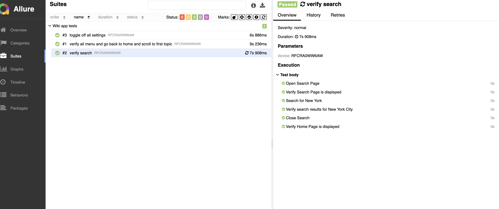
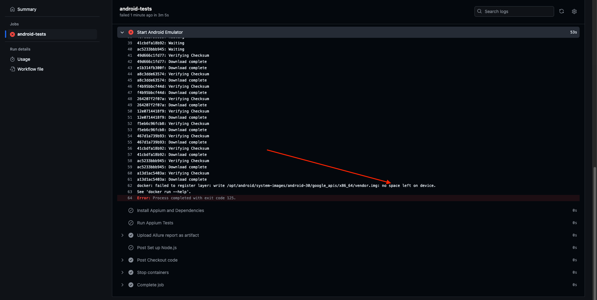

# Wiki android app test automation framework

This project is to automate the Android app E2E test cases.

### Teck Stack:

- TypeScript
- WebDriver.io
- Appium
- Allure (reporting tool)
- mocha (test runner)
- github actions (CICD)
- winston for logging

## Folder structure

- Configs are stored at `config`
- Locators are saved under `test/pageobjects`
- Page actions are saved under `test/pages`
- Tests are written at `test/specs`
- Helper and utility functions are saved under `utility`
- Appium log messages are stored under `appium.log`
- Automation tests log messages are stored under `automation-util.log`
- Test configuration are saved in `wdio.conf.ts` and android specific configs are saved in `wdio-android.conf.ts`
- Test reports generates at `allure-reports`

### Env variables

- `ENV` ['prod','staging','local'] to run tests in the specific environment. Default is `staging`
- `logger` to log the logs in the console default value is true
- `LOG_LEVEL` default is `info`

### Steps to run test

```shell
npm install
ENV= staging npm run test
```

### Steps to open report

```shell
brew install allure
Open directory where allure-report folder is present
allure open
```

Sample Report:


Sample pipeline result:

